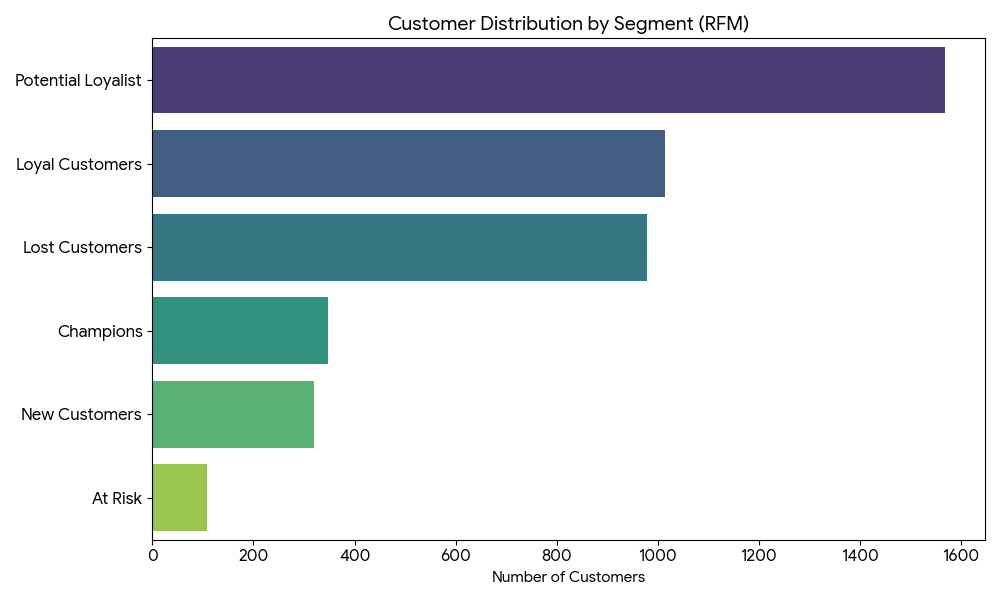
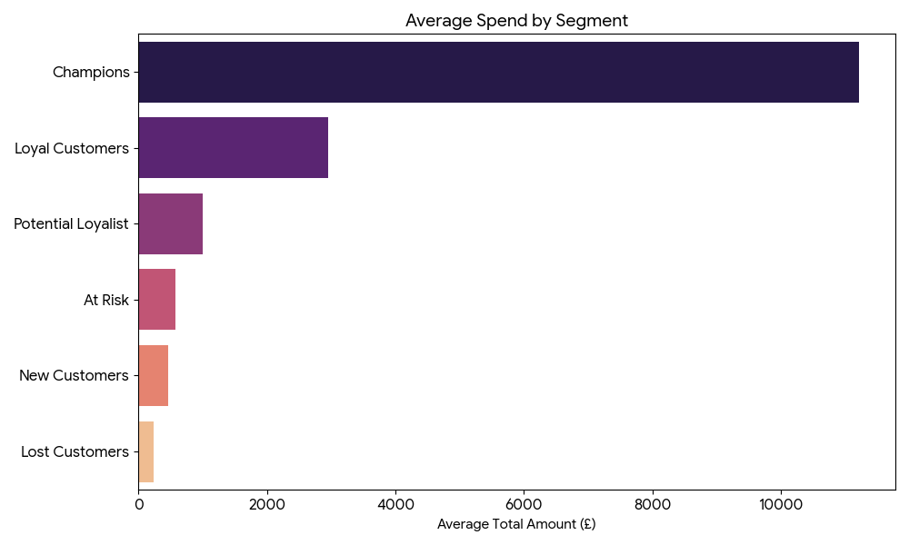
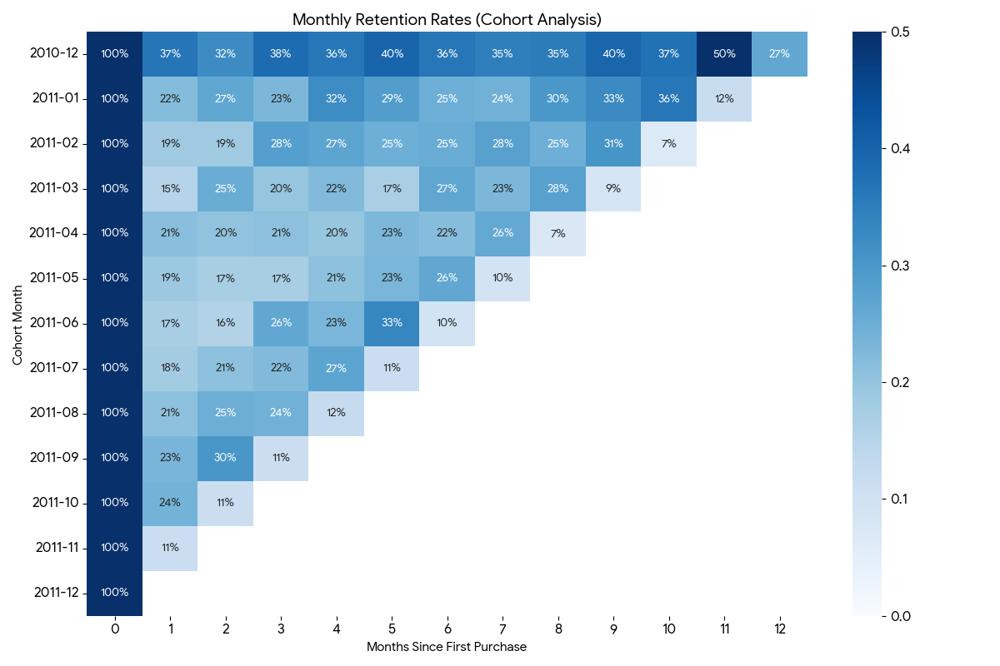

# 🛒 Retail Data Analytics & Customer Segmentation

## 📄 Project Overview
This project involves a comprehensive analysis of a UK-based online retail dataset containing over **500,000 transactions**.

The goal was to transform raw data into actionable business insights using **Advanced SQL** techniques. The project simulates a real-world analytics workflow: from cleaning "dirty" data to building a data warehouse schema and performing **RFM Segmentation** and **Cohort Analysis**.

---

## 🎯 Business Goals
1.  **Data Quality:** Clean raw CSV data handling nulls, duplicates, and format errors.
2.  **Customer Segmentation:** Group customers based on purchasing behavior (RFM) to target marketing efforts.
3.  **Retention Analysis:** Understand how many customers return after their first purchase (Cohort Analysis).

---

## 🛠️ Technical Approach (The "How")

### 1. ELT Pipeline & Data Modeling
Instead of analyzing one flat file, I normalized the data into a **Star Schema** optimized for analytics:
* **Fact Table:** `Fact_Sales` (Transactions)
* **Dimension Tables:** `Dim_Customer`, `Dim_Product`

### 2. Advanced SQL Techniques Used
* **CTEs (Common Table Expressions):** For readable and modular code structure.
* **Window Functions:** * `ROW_NUMBER()` for deduplication.
    * `NTILE(5)` for statistical scoring of customers (RFM).
    * `FIRST_VALUE()` for cohort retention calculations.
* **Data Type Handling:** Safe conversion using `TRY_CAST` to handle data inconsistencies.

---

## 📊 Key Insights & Visualizations

### 1. RFM Segmentation Results
Customers were segmented into groups like "Champions", "Loyal", and "At Risk".
* **Insight:** "Champions" make up a small percentage of users but contribute significantly to revenue.
* **Action:** Reward "Champions" with VIP offers; re-engage "At Risk" customers with discounts.

### 2. Average Spend by Segment
* **Insight:** "Champions" and "Loyal Customers" spend significantly more on average than other segments. This validates the importance of focusing retention efforts on high-value groups.
* **Action:** Create exclusive loyalty tiers for high spenders.

### 3. Cohort Retention Rate
* **Insight:** We observed a significant drop-off in customer retention after the first month (~20% retention).
* **Action:** Investigate the post-purchase experience and onboarding emails.

---

## 📂 Repository Structure

| File | Description |
| :--- | :--- |
| `01_Database_Setup.sql` | Script to create the empty database structure. |
| `02_Cleaning_and_Modeling.sql` | **Core Script:** ELT process, cleaning, deduplication, and Star Schema creation. |
| `03_RFM_Analysis.sql` | Advanced queries for Recency, Frequency, Monetary segmentation. |
| `04_Cohort_Retention.sql` | Complex self-joins to calculate monthly retention rates. |

---

## 🚀 How to Run

1.  Clone this repository.
2.  Open `01_Database_Setup.sql` in SSMS and execute to create the DB.
3.  Import the `online_retail.csv` using the SSMS Import Flat File Wizard (Target table: `stg_OnlineRetail`).
    * *Note: Set all columns to `nvarchar(50)` (and Description to 255) to avoid import errors.*
4.  Execute scripts `02`, `03`, and `04` sequentially.

---

## 👤 Author

**Lukian Kononchuk (Lu1ro)**

*Aspiring Data Analyst*

